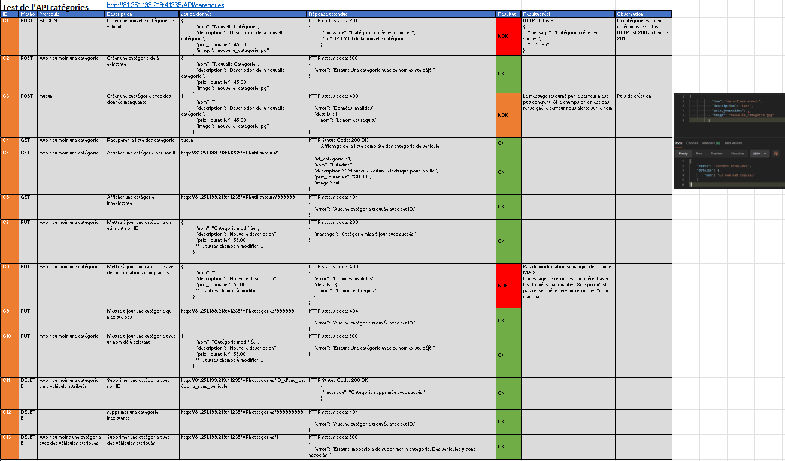
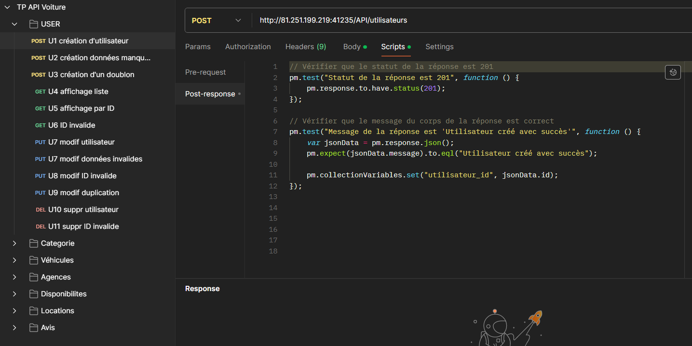
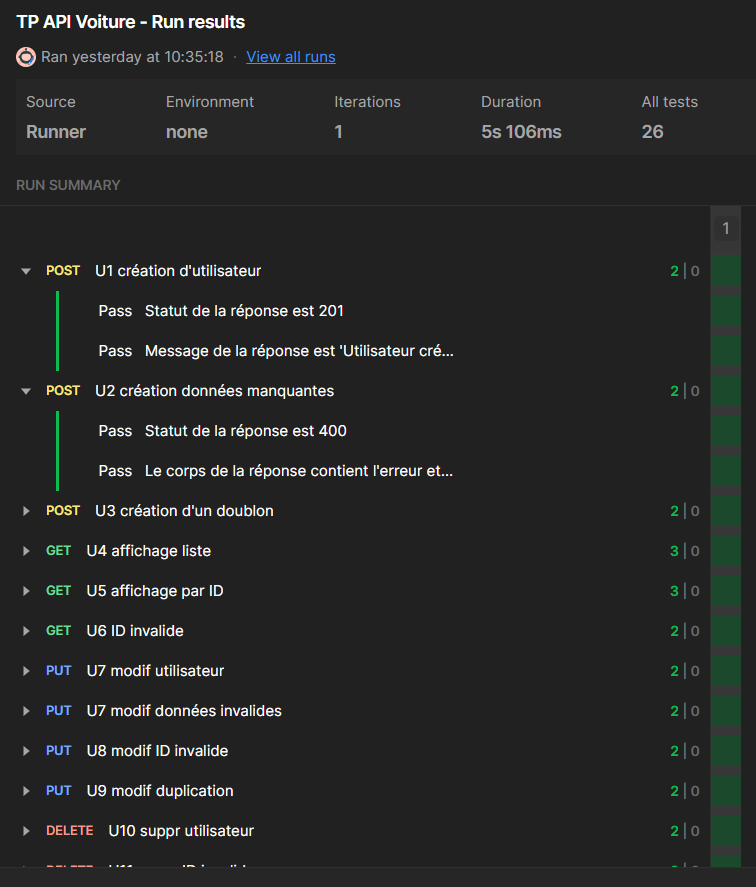

TP réaliser lors de ma formation de testeur logiciel
# Test d'une API de location de voiture
L'objectif de ce TP est de rédiger des cas de test et de les exécuter via Postman. 
Une fois les tests réalisés, nous automatisons ceux-ci afin de procéder à des tests de régression lors des évolutions logicielles.

## Déroulé 
  - Rédaction des cas de test d'après la documentation de l'API
  - Exécution des requêtes avec Postman
  - Automatisation des tests
  - Documentation des tests effectués pour le reporting
  - Création d'un rapport de test

L'API comprend 7 modules. Voici un exemple des cas de test mis en place pour un des modules. 
Le fichier complet est consultable [ICI](https://docs.google.com/spreadsheets/d/1ZAPbj0hYqTg7TQO_PFKdaKT2WmecSTOFsq97DgZpRcs/edit?usp=sharing)
 

Suite à la rédaction des cas de test, l'ensemble des requêtes a été exécuté avec Postman. Des scripts de test ont aussi été mis en place afin de les automatiser.

Voici un exemple des résultats de tests automatisés.

